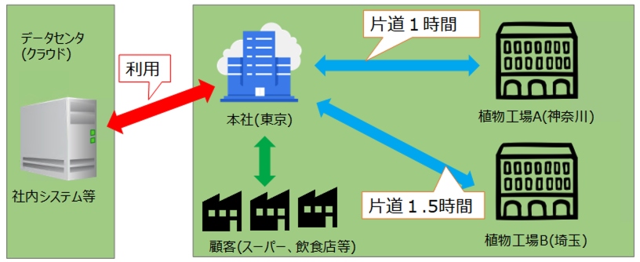
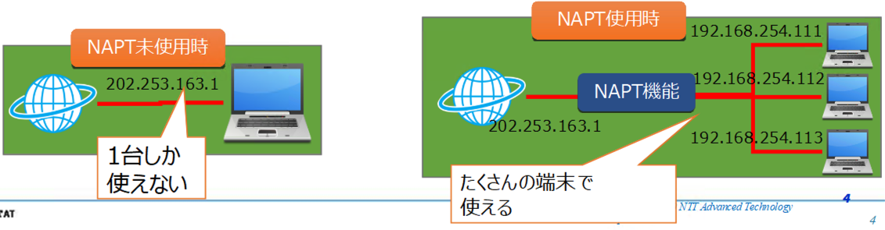

# ① お客様情報の読み込み
## お客様情報
### 基本情報
- 株式会社あんしん流通は、都内に存在する成果流通業を営む企業である。
- 主に国内の生産地から青果を仕入れ、都内のスーパーや飲食店に販売している。
- 昨今は気候の変化などで価格の変動が激しい為、１年前に自前の植物工場（室内栽培）を設立し、安定した価格で野菜を栽培・販売している。（独自ブランドとして）
- 現在は植物工場が２つ存在するが、自社ブランド野菜の販売で利益が出るのであれば工場を拡大したい。
- 植物工場の大きさは、工場Aが縦10m横5m、工場Bが縦20m横10mである。
- 本社と植物工場の関連図は、以下の通り

### 現在のICTの利用に関して
- 社内システム（販売管理システムや勤怠管理システム等）はデータセンターで稼働し、本社から利用が可能。
- 植物工場内の温度・湿度コントローラに遠隔設定を行う機能はあるが、現在は活用されていない。

### 困っていること、ICT活用への期待
- 自社ブランドやわしの販売事業を開始して１年だが、赤字である。
- 温度と湿度の設定をしても、季節や時間帯によって、実際の工場内の温度と湿度とは異なる。
- 毎日、各工場に従業員が訪問し、温度・湿度の計測とコントローラの設定をしているため人件費が掛かる。
- 過去に工場内のエアコンが故障し、すべての野菜が腐敗してしまった。
- 自動的に温度や湿度を測定して本社から確認したいが、どのような仕組みを導入したらよいか分からない。
- 働き方改革が進んだ現在、自宅勤務中でも利用できるとなお良い。  
- 従業員が工場に行かなくても自動的に工場内の温度・湿度を把握し、人件費を削減したい。
- 工場内の異常を早期に発見・対応し、野菜の腐敗等を減らしたい
- セキュリティ上、工場内のシステムへは社内からのみアクセスを可能としたい。
- 今後、工場を増やした場合でも対応できる仕組みが良い。
- 将来的には、現在手動で実施している温度・湿度設定も自動化したい。

### 自社ブランド野菜販売事業の収支状況
|科目|項目|金額|
|:----:|:----:|:----:|
|売上|自社ブランド野菜販売|130,000千円|
|支出|設備費|30,000千円|
||材料費|50,000千円|
||人件費（工場訪問）|20,000千円|
||人件費（工場訪問以外）|40,000千円|
||腐敗野菜の廃棄費|5,000千円|
|利益||-15,000千円|

### 要望・困っていること
- __温度・湿度管理がうまくいっていない__
  - 管理・制御を自動化する
  - リモート管理にする
    - 温度湿度の計測
    - 危機の遠隔コントロール
- __工場内の異常を早期に発見して対応したい__
  - 工場内の異常の監視システムを導入したい
- __本社や自宅から確認できるようにしたい__
  - セキュリティの問題を解決する必要がある
- __工場内のエアコンが正常に動作しない__
  - 現在あるシステムにIoTを導入してリモート制御と結びつけて制御する
- __自動的に温度や湿度を測定して本社から確認したい__
  - それに精通した仕組みを構築できる人材を求めている

*****
# ② 解決方法検討
### 解決方法
- 工場内の温度湿度管理システムの自動化とリモート化
→ <u>結論：工場システムの自動化・リモート化の推進</u>
  - 温度・湿度を人の手だけでなく、ICTを利用して管理する
  - 空調システムやその他の機器をリモート操作できるようにしたい

*****
# ③ 要件定義＆ヒアリング
## 要件定義
### フォーマット
- __① システムで満たすべき要件を定義すること__
  - 課題、要望などから、お客様要求を満足させる業務要件を定義する
- __② 曖昧さをなくす__
  - 必要なこと、やること、やらなくていいことを決める
- __③ 定義するポイント（一般論）__
  - 機能
    - システムに必要な機能は何か？
  - 性能/拡張性
    - どれだけ快適に使えるか？
    - 利用者が増えても大丈夫か？
  - 信頼性
    - 障害発生時にシステムを停止を短縮化する為に必要なことは何か？
  - セキュリティ
    - セキュリティを確保するために必要なことは何か？
  - 運用/保守性
    - 運用開始後に必要となる作業は何か？

### ヒアリング
- 顧客のニーズ
  - ニーズ１：）温湿度管理の精度向上
    - 手動から自動にすることで精度を向上させる
    → 廃棄野菜を減らす
    → 人件費削減
  - ニーズ２：）自宅からも工場システムへのアクセスを可能に（+社内からのみアクセス可能に）
    - セキュリティシステムの向上を図ることで、会社が望んでいる今後のリモートワークに対応
  - ニーズ３：）工場の監視システムの整備
    - 工場監視システムを整備することで異常の早期発見を図る
    → 人件費削減、廃棄野菜等のコスト削減
- 実施項目
  - ○ 温湿度管理の自動化・リモート化
    - ±2度  
  - × セキュリテイ向上
  - △ 監視システム
    - あくまでも温湿度管理の精度を高めるためのもの
    - なくても精度が高いのであれば不要？      
- 温湿度管理の自動化・リモート化の詳細
  - 機能
　  1. 正確に温度・湿度を計測する機能（誤差は±2）
  　2. エアコンをリモートで操作できる機能
　  3. 温度が不適切であった場合に自動調整する機能
  - 性能・拡張性
    - 想定利用者数：100人
    - 誤差：±2
  - セキュリティ
    - 社内からのアクセスのみ許可する
- 【まとめ】<u>最大の要求：赤字をなくしたい！！</u>
  1. __野菜の廃棄数__
    - 温度・湿度管理
    - 腐敗野菜の廃棄費5,000千円を削減できるのでは？
  2. __人件費__
    - リモート管理システム
    - 工場訪問に掛かっていた費用20,000千円を削減できるのでは？

*****
# ④ 提案書作成
## 提案書
### フォーマット
- __① お客様のお困りごと（課題）__
  - 現状の課題や背景
- __② 理想の姿（目標や効果）__
  - 本来どうあるべきか、改善後のあるべき姿（定量的だとなお良い）
- __③ 提案の内容（解決策）__
  - 実際に提案するシステムや手段（図などのも使用可能）
- __④ 費用__
  - 初期費用、ランニングコスト（運用費）

### 調査情報
1. __IoTゲートウェイ__
  - あらゆるセンサを接続し、センサからデータを収集することが可能
  - 有線LANを経由して、収集したデータを外部のWebサーバへ送信することが可能
  - センサとの通信はBluetoothにて行う
    - BLE
  - <u>１台あたりの価格は300,000円</u>
2. __環境センサ__
  - 温度、湿度、照度、気圧、騒音、紫外線を測定することが可能
  - 測定したデータをBluetooth通信でIoTゲートウェイに送信することが可能
  - 通信可能範囲は10m
    - 工場A：縦10m x 横5m
    - 工場B：縦20m x 横10m  
  - <u>１台あたりの価格は100,000円</u>
3. __Webサーバ__
  - インターネットを通じてWebブラウザで表示するコンテンツ（画面）を利用者に提供することが可能
  - Webサーバ上でプログラムを動作させることで、利用者の要望に応じたコンテンツの提供が可能
  - 通信はHTTP（ポート番号`80`）が前提である
  - 各種機器の管理システムも構築・配置が可能
  - <u>１台あたりの利用料は100,000円/月（データセンタのクラウド環境を利用）</u>
4. __収集データ表示用Webアプリケーション__
  - Webサーバ上で動作し、収集データの加工やWebブラウザに表示する画面の提供が可能
  - アプリケーションの開発は自社で行う必要がある
5. __温度・湿度コントローラ__
  - インターネット経由（ポート番号`5000`）でコマンドを受信することにより遠隔での操作が可能
6. __ファイアフォール__
  - ２つ以上の異なるネットワークを中継することが可能（NAPT機能）
    - ネットワーク上で通過させてはいけいない通信を阻止するために導入される
    
  - 企業内のネットワーク等、外部からの不正な通信（攻撃等）を阻止するために導入される
  - <u>１台あたりの価格は300,000円</u>
7. __スイッチングハブ__
  - 同一ネットワークにおいて、LANケーブルで接続された機器間のデータ送受信を中継することが可能
  - <u>１台あたりの価格は50,000円</u>
8. __インターネット回線__
  - インターネットに接続するための回線
  - <u>１契約で利用可能なグローバルIPアドレスは１つ</u>
  - <u>１回線あたりの利用料は6,000円/月</u>

### 提案書作成のポイント
1. 課題解決の軸を決める
2. キャッチコピーやキーワードも有効
3. 具体性があり結果が想像できる提案
4. お客様が気づいていない課題の真因を探る
5. やらないことも明確にする
5. 次のフェーズの提案も含めてみる

### もずくラボからの提案
- 提案書
  1. 課題（困りごと）
    - 赤字（人件費・廃棄野菜の無駄なコストが多い）
  2. 目標
    - 人件費削減・廃棄野菜を無くすことで赤字脱出
  3. 解決策
    - 温度・湿度管理の自動化及びリモート化
  4. 費用
    - 初期投資：1,500,000
    - 年間管理費：1,272,000
- 必要な機器
  - IoTゲートウェイ（計測）
    - 個数：2（工場分）
  - 環境センサ（計測）
    - 個数：A1, B2
  - Webサーバ（操作）
    - 個数：2（予備含む）
  - 収集データ表示用Web アプリケーション
    - 温度・湿度コントローラ
  - ファイアウォール
    - 個数：2
  - スイッチングハブ
    - 検討中...
  - インターネット回線
    - 3本

*****
# ⑤ プロジェクト計画書作成
## プロジェクト（PJ）計画書
### フォーマット
- ① __目的__
  - このPJをやる目的は何か
- ② __体制__
  - どのような役割が必要で、誰がどの役割をやるか
  - （基本設計、詳細設計、試験項目作成、製造、構築、試験実施）
- ③ __コスト（費用）__
  - PJを遂行するために必要な費用（人件費やハードウェア費用など）
- ④ __スケジュール__
  - 必要な作業項目は何か
  - 期間はどれだけ掛かるか
  - 誰がやるか
- ⑤ __品質__
  - 目標とする品質レベルを設定する
  - 試験密度やバグ密度など数量的に

### 目的
- 発注元の運営する屋内野菜栽培工場の温度湿度管理情報及び管理システムの遠隔管理を実現する

### メモ
- ※ __お客様からの追加要望が発生した場合__
  - 内容
    - 温度や湿度がある閾値を超えたらメールで通知する機能を、今の金額とスケジュールでやって欲しいが可能か？
  - 結論
    - <u>この様な場合、PJ計画の見直しや設計書の修正、追加試験などの作業が追加で発生する</u>
    - 労働者の残業が発生したり、スケジュール遅延等が発生する場合がある
    → Case-by-Case

# ⑥ KPTによる振り返り
## K：Keep
- 続けること（良かったこと）
  - 各個人ごとに良かったこと、努力したこと、工夫したことを挙げてもらう
  - その後、チーム内で共有する

## P：Problem
- 問題点、改善すべき点
  - <u>控えめにする！</u>
  - 各個人ごとにもっとこうした方が良かったことや見直し、改善が必要だと感じたことを挙げてもらう
  - その後、チーム内で共有する

## T：Try
- 次にすること（チャレンジすること）
  - <u>ポイント：特にしっかり書く（具体的に！）</u>
  - 今回のプロジェクトを振り返って次に生かせる点、これからチャレンジすることを共有する
  - Keep, Ploblemを元に考える
